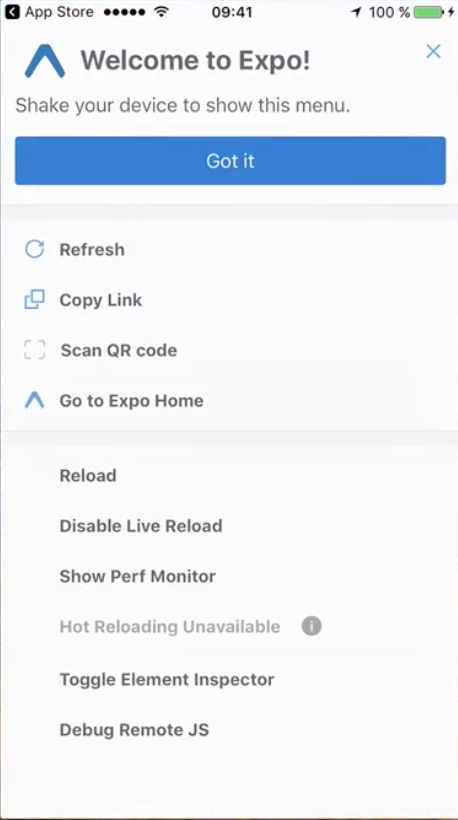

# React Native Development 2018

## From Beginner to Professional

---

**About Me**
My name is Joseph Pulaski I am a Fullstack Software Engineer focused primarily on React Native & React.js. I have been a Software Engineer for almost 4 years. It has been quite the journey. I love to continually educate myself and add to my developer super powers.

During the day I work for New York City as a Lead Mobile Engineer. I Cover 3 Mobile React Native Mobil applications and 7 React Applications that are all networked with one another in some way.

On my own time I love to create impactful learning content that will hopefully pave the way for those to come after me and help them to reduce their learning curves.

It has been said that "You don't know, what you don't know.". In software development this is very true.

My goal in this course is to highlight all of those little gotcha's that can take a new developer hours or days to solve,so that it will take you a lot less time than it took me.

## Welcome

---

### What is React Native?

React Native is a "Learn Once, write everywhere" toolset that run natively on any number of platforms.

The team at Facebook built a javascript VM that acts a bridge between our modern JavaScript code and the native components that run on Android and iOS. We can think of it as a "translator".

With RN we can build Mobile applications using JavaScript and React Native specific code.

It is not a web app or a hybrid app like Ionic or Cordova.

It is important to understand that if you are coming from a web development background, there will be a learning curve. In React Native, we are not rendering views using the DOM.

It is my opinion that React Native can be a double edge sword to the untrained eye. By this I mean, while the React team clevery created a way for us webbies to create native application's using syntax and concepts that we are familiar with, this also creates confusion because even though many of the concepts seem familiar, they are implimented in very different ways. We will dive deeper into examples later on.

React Native, replaces the DOM and gives us a DOM like machine, along with a number of great utilities and helper functions. So at is core, it is still a good old rendering engine, On steroids.

---

**Lets Look at rendering comparison**

| React.js  | Android        | iOS           | React Native   |
| --------- | -------------- | ------------- | -------------- |
| `<div>`   | `android.view` | `UIView`      | `<View/>`      |
| `<input>` | `EditText`     | `UITextField` | `<Textinput/>` |

So the React Native column has RN components that will be turned into theirAndroid and iOS, resectively, counterparts. To give you some context, the far left column are the DOM components that correspond to behaviors of the other components in a given row.

### Are We writing JavaScript or Not?

Yes we are, on the front end our JS logic is getting compiled by the React Native VM.

**What about on the backend**

Yes, we are righting JS and **_NO_** it is not being compiled into Native code.

React Native creates us our own JS thread that is hosted within the application environment and is not transpiled.

**This is an important concept to understand...**

```diff
- React Native is providing a bridge for our UI to transformed into native code.

+ When it comes to our logic, it stays JavaScript
```

Okay thats enough complexity for now. all of this stuff is happening under the hood and you will likely not have to interface with it for awhile.

### Creating your first React app

#### Project setup

1. Install [Node version 8.12.0](https://nodejs.org/dist/v8.12.0/node-v8.12.0.pkg)

2. install the yarn package manager with the `brew install yarn` command

3. Install the create-react-app utility which has now been merged with expo. to do this we `yarn global add create-react-native-app` or `yarn global add expo-cli` in your terminal.

4. Navigate to the parent folder of where you would like to create your project and use the `create-react-native-app "NameOfYourApp"` or the `expo init "NameOfYourApp"`.

5. Navigate into the directory of your new application are start it up with `yarn start` or `npm start`.

   - If you see any Errors, please create an issue in the repo and one of our community members will reach out to you to help you with a solve.
   - **After your application starts successfully** you will see a QR code in your terminal, if you scan it with your camera app it will prompt you to instal the expo mobile application. This is a great tool for viewing your dev application on your mobile device. We will be using it.

   **NOTE**
   **`We will only be using this utility for now to get up and running and learning quickly. We will enventually break away from this as we get more comfortable with the React Native development workflow.`**

   Your application will start building/bundling and you will see a lot of output in your terminal.

6. When your app has finished building press i or a in your terminal and you should see the following:

   

   ***

Lets open up an IDE. We recommend using VSCode. it is, in our opinion the best modern editor and it has tons of tools for developing javascript and React/RN.

Open the the `App.js` file and you will notice that there is `<View>` element encapsulating 3 `<Text>` elements.

By playing with the text and the text tags and then saving your changes you will see the differences in you app upon saving. One of the cool features about RN is the Hot Reloading that we get out of the box with expo. By hot reloading we mean the ability to make changes, save your files, and have those changes refresh instantly.

#### React Native and its Limitations.

React Native is awesome because we allows to create Native Apps in one code base. However, this presents challenges. Not everything can be reconciled across both iOS and Android. Truth is, both platforms have unique differences that cant be transferred to the other. This happens a lot in when it comes to style and creating responsiveness across different devices and screen sizes.

There is also the need to create a lot of custom components because we are not given all the things we are given in a web UI library that is running on the same backbone everywhere.

Essentially, we are given the neccessary components to do the job, but we have to get creative.

Another thing worth mentioning and definitely to be taken into consideration when deciding whether or not to use it in a project is the fact that there a lot of moving parts. Firstly, React is rapidly iterating. That coupled with the fact that so are Android and Apple, means that a lot of things can break and change over time.

**Thats why we are here anyway right?**

---

## React Native Basics

### Creating a New React Project with Expo

To begin, we are going to build using the **Expo** Tool. IT lets us get an application up and running quickly without having to do any crazy configs, or worrying about extensive tooling like XCode or Android Studio.

1. **Make sure you have an LTS Version of Node Installed.**

2. **In your terminal, type the following command.**

   - `yarn global add expo-cli`

3. **Next we are going to init a new expo project by typing the following command in the terminal.**

   - `expo init YourProjectName`

4. **Navigate into your project directory and type:**

   - `npm start` or `yarn start`

   **This will start your dev server and your application is ready to run. At this piont you can install the Expo app on your phone or open your app in an emululator on your computer**

### Creating a New React Project with Expo

In order to create a stand alone React Native project you must do take many extra steps. Do so with caution. you would do well to remember that RN is under active development and XCode, iOS, Android and Android Studio are on the move as well. There is a good likelihood that you will wind up having to do some serious debugging. In order to begin this process, in the terminal, do the following:

#### ON MacOS

1. **brew install node**
2. **brew install watchman**
3. **sudo npm install -g react-native-cli**
4. **Install XCode**
   - Follow the React Native specfic instructions [here](https://facebook.github.io/react-native/docs/getting-started.html#xcode)
   - [Mac App Store](https://itunes.apple.com/us/app/xcode/id497799835?mt=12)
5. **react-native init yourproject**
6. **`cd YourProjectName`**
7. **`react-native run-ios`**

If the `react-native run-ios` command fails this is where you begin debugging.

The best things you can do are:

- pay attention to your error messages,
- copy and paste them into the browser to check for solutions
- visit the [known issues on the RN Repo on Github](https://github.com/facebook/react-native/issues)

### Understanding JSX

---

## React Native & Redux

---

## Debugging

---

## Styling

---

## Animation

---

## Navigation

---

## Extensions and Third Party Integrations

---

## Forms

---

## Accessing Device Camera

---

## GPS & Maps

---

## HTTP Requests

---

## Authentication

---

## Release Prep

---

## Publishing
